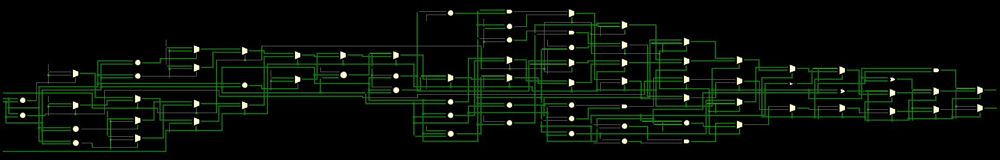
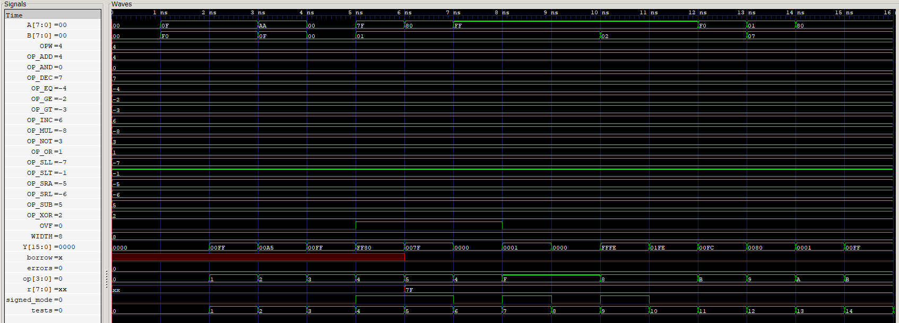

# ALU
## Overview 
A Parametric Arithmetic Logic Unit (ALU) written in SystemVerilog at the RTL level suitable for integration into a CPU datapath.

### Repository Structure
```text
ALU/
├── README.md           - Readme File
├── alu.sv              - Arithmetic-Logic Unit
├── tb_alu.sv           - Testbench
├── sim                 - Simulation File
├── tb_alu.vcd          - Waveform File
├── waveform.png        - Waveform Diagram
├── schematic.sch       - Schematic File
├── schematic.png       - Schematic Diagram
```

### Features
- Synthesizable RTL structure with testbench, waveform, and schematic.
- Takes two operands (A, B), an operation select (op), and produces a result (Y), and optional flags (e.g. overflow).
- Parametric (Not hard-coded, scalable).
- Logic, arithmetic, shift, and comparison operations.
- 4-bit opcode interface.
- Signed/unsigned mode control.
- Overflow flag generation.
- Testbench verification.

### 4-bit Opcode Table
| Opcode | Operation | Definition | Type |
|---|---|---|---|
| 0000 | AND | Y = A & B | LOGIC |
| 0001 | OR  | Y = A \| B | LOGIC |
| 0010 | XOR | Y = A ^ B | LOGIC |
| 0011 | NOT | Y = ~A  | LOGIC |
| 0100 | ADD | Y = A + B | ARITHMETIC |
| 0101 | SUB | Y = A - B | ARITHMETIC |
| 0110 | INC | Y = A + 1 | ARITHMETIC |
| 0111 | DEC | Y = A - 1 | ARITHMETIC |
| 1000 | MUL | Y = A * B  | ARITHMETIC |
| 1001 | SLL | Y = A << shamt| SHIFT |
| 1010 | SRL | Y = A >> shamt (logic) | SHIFT |
| 1011 | SRA | Y = A >>> shamt (arithmetic) | SHIFT |
| 1100 | EQ  | Y = (A == B) ? 1 : 0 | COMPARISON |
| 1101 | GT  | Y = (A >  B) ? 1 : 0 | COMPARISON |
| 1110 | GE  | Y = (A >= B) ? 1 : 0 | COMPARISON |
| 1111 | SLT | Y = (A <  B) ? 1 : 0 | COMPARISON |

## Setup Development Environment

### Prerequisites
- VS Code with an integrated PowerShell terminal.
- This repository cloned locally.
- [Optional HDL extension for VS Code.](https://marketplace.visualstudio.com/items?itemName=mshr-h.VerilogHDL)

### Installation
- [Download Icarus Verilog & GTKWave.](https://bleyer.org/icarus/)
- Make sure to select Full Installation when running the .exe.

## Usage
0. Delete files '`sim`' and '`tb_alu.vcd`'.
1. In the VS Code terminal, run: 
    - `iverilog -g2012 -o sim tb_alu.sv alu.sv`
    - `vvp sim`
    - `gtkwave tb_alu.vcd`
2. Click tb_alu in GTKWave and view signals as needed.

Note: You can also generate the schematic in AMD Vivado software.

## Expected Results

### Schematic

### Waveform

